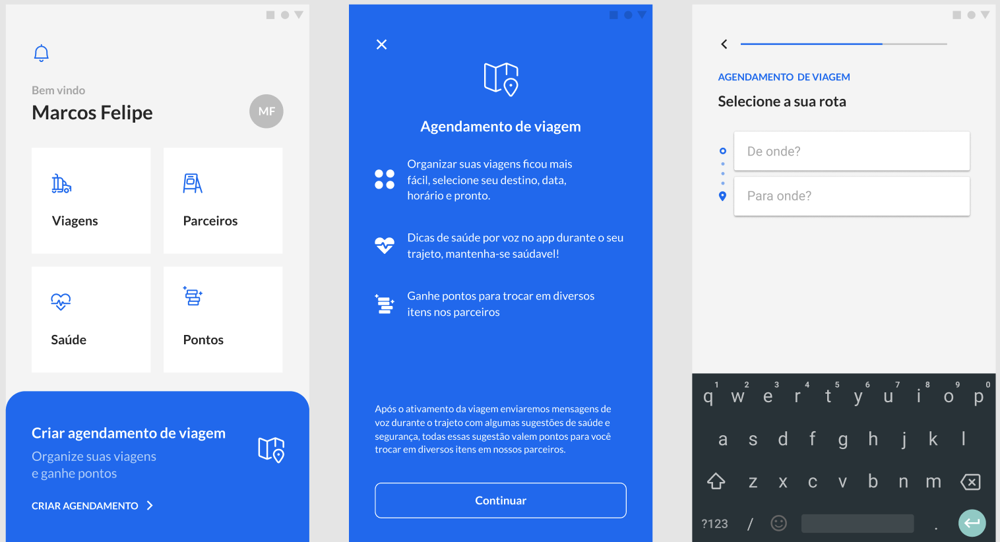
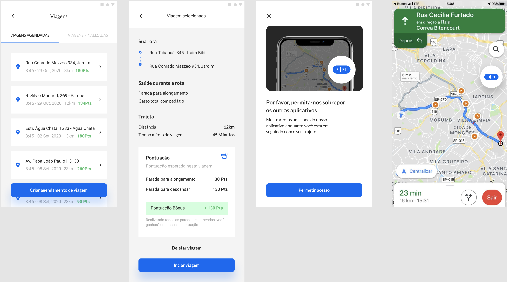
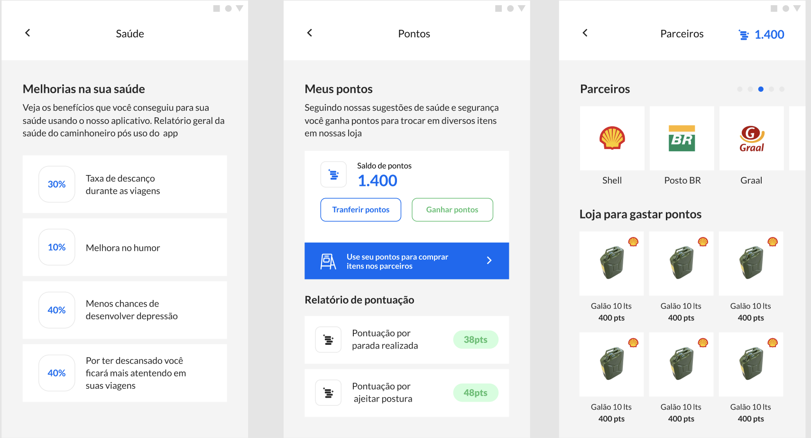

## Hackathon CCR 2020

Gerar ideias voltadas para a rotina dos caminhoneiros, encontrando soluções para melhorar a qualidade de vida nas estradas, principalmente quanto à saúde física e mental desses profissionais.

## URL do projeto:
[https://hackathon-ccr-grupo-43.netlify.app/](https://hackathon-ccr-grupo-43.netlify.app/)

## Visualização:

## Scripts disponíveis
No diretório do projeto, você deve executar:

### `yarn install`
### `yarn start`
### `yarn serve`

Depois basta abrir o google chorme na url:
[http://localhost:3000](http://localhost:3000)

